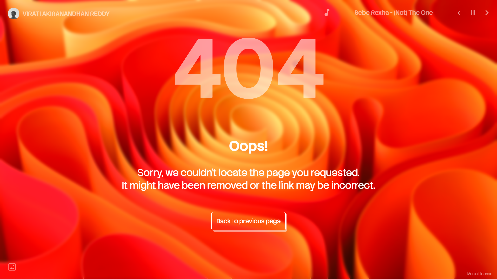

<div align="center">
    
    
    
    
    <a href="https://github.com/ViratiAkiraNandhanReddy/awful"></a>
    
  <h1>404-blurglass-max</h1>
  <p><em>Advanced glassmorphism 404 page with music player and background switching.</em></p>
</div>

---

## **📎 Why 404-blurglass-max?**

A **modern, responsive, glassmorphism-themed 404 error page** featuring:

* 🎵 **Interactive hover-expand music widget** (with track navigation & autoplay)
* 🖼️ **Background image switcher**
* 🧊 **Smooth glassmorphism UI**
* 📱 **Fully responsive layout**
* 🎨 **Pixel-perfect typography**
* 🪪 **Built-in music license link**
* 💡 **Logo header & return button**

This project is designed for static websites (GitHub Pages, Netlify, Vercel, etc.) and supports customizable assets, tracks, and background images.

---

## **📸 Preview**

### **Desktop View**



### **Mobile View**

.png)

---

## **✨ Features**

### **1. Glassmorphism Interface**

* Full-screen frosted glass effect
* Blur + saturation for premium UI
* Smooth transitions & minimalistic layout

### **2. Music Widget**

* Appears as a compact icon
* Expands on hover
* Shows:

  * Current track name
  * Previous / Next buttons
  * Play / Pause toggle
* Audio starts from a **random track**
* Multi-track playlist support
* Autoplay next track on end
* Fully muted by default (user gesture required)

### **3. Background Switcher**

* Hover-expand wallpaper control
* Next / Previous background
* Starts with a random background
* Full-screen cover images
* Smooth transitions

### **4. Responsive Typography**

* Dynamic `vh` and `vmin` units
* Adapts perfectly to desktop & mobile

### **5. High-Quality Structure**

* Clean separation of:

  * `HTML`
  * `CSS`
  * `JavaScript`
  * Assets (images + audios)
* Best suited for GitHub Pages hosting

---

## **📁 Project Structure**

```
404-blurglass-max/
│
├── index.html
│
├── not-found/
│   ├── css/
│   │   └── 404.styles.css
│   │
│   ├── javascript/
│   │   └── 404.script.js
│   │
│   └── assets/
│       ├── audios/
│       │   ├── Ed Sheeran - Shape of You.mp3
│       │   ├── Bebe Rexha - I Got You.mp3
│       │   └── ...
│       │
│       └── images/
│           ├── bg-01.jpg
│           ├── bg-02.jpg
│           └── bg-03.jpg
│
├── preview/
│   ├── desktop.png
│   └── mobile - (iPhone 14 Pro Max).png
│
├── favicon.ico
├── LICENSE
└── README.md
```

---

## **🚀 Live Demo**

<kbd>**[/404-blurglass-max/](https://viratiakiranandhanreddy.github.io/404-blurglass-max)**</kbd>

---

## **🛠️ Installation & Setup**

### **1. Clone the Repository**

```bash
git clone https://github.com/ViratiAkiraNandhanReddy/404-blurglass-max.git
```

### **2. Place Assets**

* Put your background images inside:
  `not-found/assets/images/`
* Put your audio tracks inside:
  `not-found/assets/audios/`

### **3. Add the 404 Page to GitHub Pages**

Rename the file:

```
index.html → 404.html
```

Then push to your GitHub Pages repo.

GitHub Pages automatically uses `404.html` for missing pages.

---

## **🧩 Customization**

### **🔹 Change Tracks**

Edit `404.script.js`:

```js
const tracks = [
  { name: "Song Name", file: "not-found/assets/audios/song.mp3" }
];
```

### **🔹 Add More Backgrounds**

```js
const backgrounds = [
  "not-found/assets/images/bg-01.jpg",
  "not-found/assets/images/bg-02.jpg",
  "not-found/assets/images/bg-03.jpg",
  "not-found/assets/images/your-new-bg.jpg"
];
```

### **🔹 Logo & Branding**

Modify in `index.html`:

```html

<span class="name">YOUR NAME</span>
```

---

## **🎧 Music Licensing**

All music tracks used belong to their respective owners.
This project uses tracks **under fair use** for a **non-profitable personal portfolio**.

A dedicated **Music License** page is linked at the bottom-right of the 404 screen.

<kbd>**Music License:** [/license/](https://viratiakiranandhanreddy.github.io/license/)</kbd>

---

## **🤝 Contributing**

Pull requests are welcome!

To contribute:

1. Fork the repository
2. Create a new branch
3. Add your changes
4. Open a PR

---

## ⭐ Support
<kbd>If you like this project, consider giving it a star ⭐ on GitHub — it helps a lot.</kbd>

---

## 🌐 Social & Links

[](https://www.linkedin.com/in/viratiakiranandhanreddy/)
[](https://x.com/Viratiaki53)
[](https://instagram.com/viratiaki53)
[](https://facebook.com/ViratiAkiraNandhanReddy)
[](https://gist.github.com/ViratiAkiraNandhanReddy)
[](https://www.youtube.com/@ViratiAkiraNandhanReddy)
[](https://viratiakiranandhanreddy.github.io/CaesarCipher.extended/)
[](mailto:contact.viratiakiranandhanreddy+github@gmail.com)

---

## 📝 License

<p align="center"><kbd>&copy; 2025 <a href="https://github.com/ViratiAkiraNandhanReddy">ViratiAkiraNandhanReddy</a>. This project is licensed under the <i>MIT License</i>.</kbd></p>

---

## 👤 Author

### Developed by [ViratiAkiraNandhanReddy](https://github.com/ViratiAkiraNandhanReddy)

> 💤 - PASSIVE MAINTENANCE : Mean the project is no longer actively developed ***( NO New Features And Regular Updates )***, but the maintainer will respond only when an issue or PR is raised. Feel free to fork and continue development!

---

<h3 align="center"> 🌟 Questions, suggestions, or want to contribute? Open an issue or pull request on GitHub! 🌟 </h3>

<p align="center">  </p>
